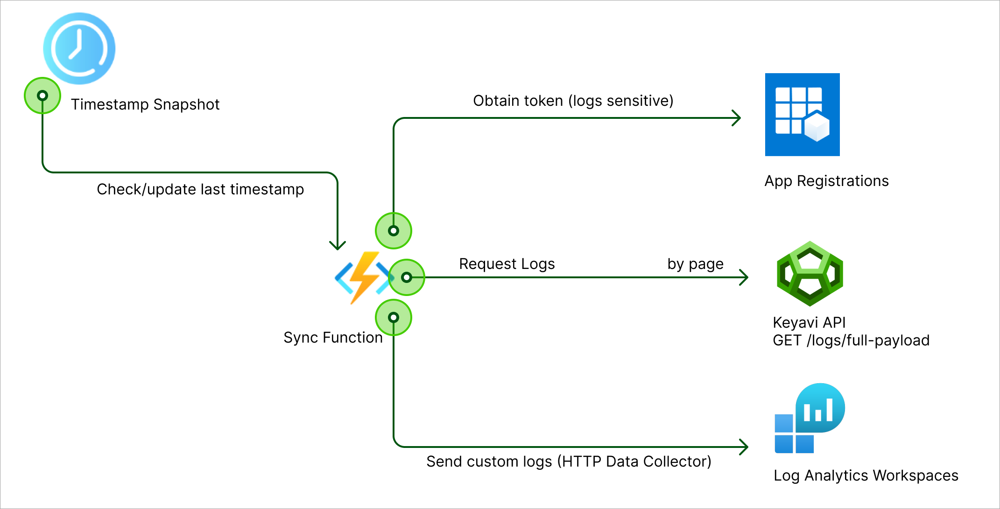
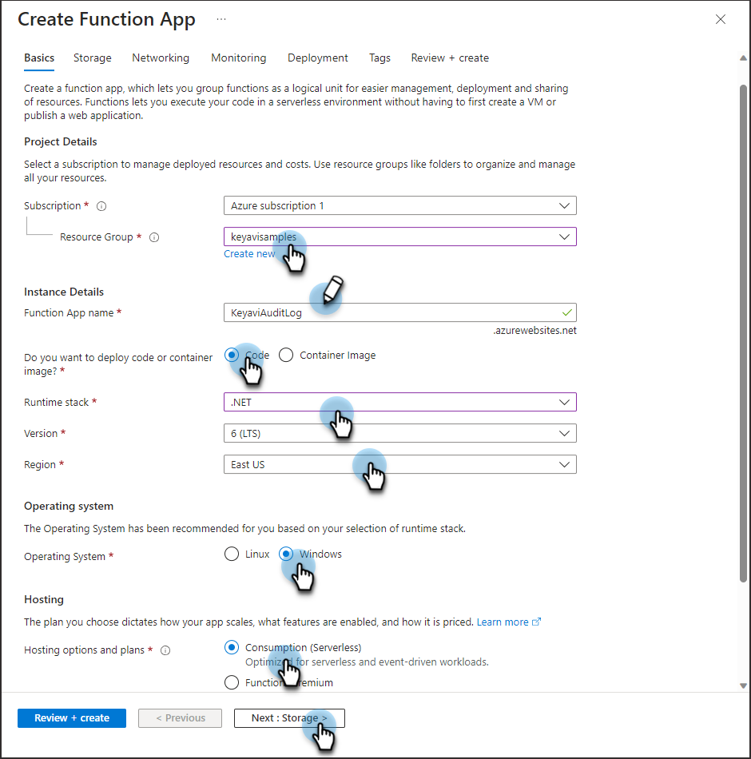

Keyavi technology is a data protection platform that wraps your data with multiple layers of encryption and user-defined policies. As a result, your data becomes self-protecting, smart or intelligent, and self-aware.

With Keyavi’s API you can integrate audit and forensics with other tools and technologies. The Keyavi sample code in this repository checks the Audit and Forensics logs in Keyavi and exports the data to a Microsoft Log Analytics workspace. You can further integrate that data with Security Information and Event Management (SIEM) tools like Microsoft Sentinel.



# How it Works

You'll set up a function in Azure that connects with the Keyavi Audit and Forensics `/api/logs/full-payload endpoint`. We'll call it the **Keyavi Audit Log function**. That function will call the Keyavi API every five minutes to check for the last two days worth of Audit and Forensics logs. If the function finds nothing has changed, the function stops. If the function finds new data, it timestamps the last succesfully synced log ID and stores it in blob storage. The Log Analytics workspace accesses the blob storage with the logs. 

# Prerequisites
* Credentials for the Keyavi API. Refer to the API Documentation at [docs.keyavi.com](https://docs.keyavi.com/docs/apidocs/apiIntro). This sample is compatible with Keyavi 2.3.0 and Keyavi 2.4.0.
* The .NET 6.0 SDK (https://dotnet.microsoft.com/download/dotnet/6.0).
* A .NET project in the folder `Keyavi.Logs/Keyavi.Logs.LogAnalyticsWorkspace`.
* Azure Command-Line Interface (CLI) (https://docs.microsoft.com/en-us/cli/azure/install-azure-cli). Optional if you prefer the comand line.
* Visual Studio 2019 (https://visualstudio.microsoft.com/downloads/).
* Azure Functions Core Tools installed on your local machine. [See this article for information and to download it](https://learn.microsoft.com/en-us/azure/azure-functions/functions-run-local). Optional depending on how you prefere to deploy functions.
* Windows runtime for the function. 
* Workspace permissions in Azure Monitor Logs with a minimum of **contributor rights**. See [Workspace permissions](https://learn.microsoft.com/en-us/azure/azure-monitor/logs/manage-access?tabs=portal#azure-rbac).

# Set Up Azure

In Azure, you'll set up an environment, resource group, storage account, and the **Keyavi Audit Log function**. You can follow the steps using either the Azure Portal or Azure CLI. 

## Set up the Azure Environment

Before creating the **Keyavi Audit Log function** you'll set up a Resource Group to hold the function and a Storage Account for operations such as managing triggers and logging function executions.

1. Log in to Azure.

    #### <u>CLI</u>
    ```bash
    az login
    ```

2. Create or identify an existing Resource Group to hold the function. 

    #### <u>Create a Resource Group with CLI</u>
    ```bash
    az group create --name MyResourceGroup --location westus
    ```
    Where:
    * `MyResourceGroup` is the name of the Resource Group you're creating.
    * `westus` is your preferred location.

    #### <u>Create a Resource Group in the Azure Portal</u>
    Search for and select **Resource groups**. On the Resource groups page, create or identify a Resource Group. For detailed steps to create a Resource Group, see [Manage Azure resource groups by using the Azure portal](https://learn.microsoft.com/en-us/azure/azure-resource-manager/management/manage-resource-groups-portal).


3. Create or identify an existing Storage Account. We recommend further Storage Account configurations as required by your organization and [recommended by Azure in thier documentation](https://learn.microsoft.com/en-us/azure/storage/common/storage-account-create?toc=%2Fazure%2Fstorage%2Fblobs%2Ftoc.json&bc=%2Fazure%2Fstorage%2Fblobs%2Fbreadcrumb%2Ftoc.json&tabs=azure-portal). 

    At a minimum, you must [Configure Azure Storage connection strings](https://learn.microsoft.com/en-us/azure/storage/common/storage-configure-connection-string) (Access Keys). 

    #### <u>Create a Storage Account with CLI</u>

    ```bash
    az storage account create --name MyStorageaccount --location westus --resource-group MyResourceGroup --sku Standard_LRS
    ```
    Where:
    * `MyStorageaccount` is the name of the Storage Account you're creating.
    * `westus` is your preferred location.
    * `MyResourceGroup` is the name of the Resource Group you either created or identified in the previous step.
    * `Standard_LRS1` is the recommended value for `sku`.

    #### <u>Create a Storage Account in the Azure Portal</u>
    Search for and select **Storage accounts**. On the Storage accounts page, create or identify an existing Storage Account. For detailed steps to create a Storage Account, see [Create a storage account](https://learn.microsoft.com/en-us/azure/storage/common/storage-account-create).


## Create the Keyavi Audit Log Function

Use the Resource Group and Storage Account you created or identified in the previous steps to create the **Keyavi Audit Log function**.

#### <u>Create the Function with CLI</u>

    ```bash
    az functionapp create --resource-group MyResourceGroup --consumption-plan-location westus --runtime dotnet --functions-version 4 --name MyAppName --storage-account  MyStorageaccount --os-type Windows
    ```

    Where:
    * `MyResourceGroup` is the name of the Resource Group you either created or identified earlier.
    * `westus` is your preferred location.
    * `MyAppName` is the name of the function. You can call it whatever you like, but we suggest something like **KeyaviAuditLog**.
    * `MyStorageaccount` is the name of the Storage Account you created or identified earlier.

#### <u>Create the Function in the Azure Portal</u>
1. From the Azure portal menu or the Home page, click **Create a resource**.
1. Find **Function App** and click **Create**.
1. Configure the function on the **Basics** tab:
    * **Resource Group**: Select the Resource Group you created or identified earlier.
    * **Function app name**: Enter a name. You can call it whatever you like, but we suggest something like **KeyaviAuditLog**.
    * **Do you want to deploy code or container image?**: Select **Code**.
    * **Runtime Stack**: Select **.NET**.
    * **Version**: Select **7 (STS) Isolated**.
    * **Region**: Select your preferred location.
    * **Operating System**: Select **Windows**.
    * **Hosting**: Select **Consumption (Serverless)**.

    

1. Click **Next: Storage** or the **Storage** tab at the top.
1. Select the Storage Account you created earlier.
1. Click **Review + Create**.
1. Review the function details, and then click **Create**.


## Update Your Configuration

Now that you've set up the **Keyavi Audit Log function**, you can update the code in the repo with your specific information.

1. Navigate to your project folder.

    ```bash
    cd Keyavi.Logs/Keyavi.Logs.LogAnalyticsWorkspace.Function
    ```

1. Open **appsettings.json**.
1. Update the `KeyaviApi` attributes in with your information.
    The `KeyaviApi` attributes contain the configuration for your Keyavi API. For more details, see [Keyavi API Documentation](https://docs.keyavi.com/docs/apidocs/apiIntro).
    | Attribute| Description |
    | ---------| ----------- |
    | baseUrl | The base UL is configured in Keyavi deployment and follows this pattern: `https://<Custom API URL>/api/`. See [HTTP Requests in the Keyavi Docs](https://docs.keyavi.com/docs/apidocs/apiIntro#http-requests) | 
    | ClientId | Your configuration's Client ID. See [Authentication in the Keyavi Docs](https://docs.keyavi.com/docs/apidocs/apiIntro#authentication).   |
    | ClientSecret | Your configuration's Client Secret. See [Authentication in the Keyavi Docs](https://docs.keyavi.com/docs/apidocs/apiIntro#authentication). |
    | TenantId | Your configuration's Tenant ID. See [Authentication in the Keyavi Docs](https://docs.keyavi.com/docs/apidocs/apiIntro#authentication).  |
    | Scopes | Your configuration's scope address. See [Authentication in the Keyavi Docs](https://docs.keyavi.com/docs/apidocs/apiIntro#authentication). |
    | IsB2C | This value depends on your Keyavi Configuration. For Keyavi Standard Configuration with Consumer Support, enter `true`. For Keyavi Standard Configuration, enter `false`. |
    | Authority | Only required for Keyavi Standard Configuration with Consumer Support. Otherwise, leave blank. The Authority is A URL based on the tenant name of the AAD B2C tenant in this format: `https://<b2c-tenant-name>.b2clogin.com/{0}/v2.0` |
1. Update the `AzureLogWorkspace` attributes in the file with your information.
    The `AzureLogWorkspace` attributes contain the configuration of your Microsoft Log Analytics workspace. For more details, see [Log Analytics REST API Reference](https://learn.microsoft.com/en-us/rest/api/loganalytics/).
    | Attribute| Description |
    | ---------| ----------- |
    | baseUrl | Keep the default to the required version of the Application Insights REST API. | 
    | SharedKey | The account access key for your Log Analytics workspace. The shared key must have permissions to create tables. See [Get a connection string for the storage account](https://learn.microsoft.com/en-us/azure/storage/common/storage-account-get-info?tabs=portal#get-a-connection-string-for-the-storage-account)|
    | LogName | The name of the table you will create and maintain in the Log Analytics workspace.  |
    | WorkspaceId | The unique identifier for the Log Analytics workspace available on the Overview page in the Azure Portal. [maybe](https://learn.microsoft.com/en-us/rest/api/loganalytics/create-request) |
1. Update the `AzureStorageAccount` attributes in the file with your information.
    The `AzureStorageAccount` attributes contain the configuration of the Azure Storage Account you're using. For more details, see [Log Analytics REST API Reference](https://learn.microsoft.com/en-us/rest/api/loganalytics/).
    | Attribute| Description |
    | ---------| ----------- |
    | ContainerName | The name of the container that will store the Keyavi Audit and Forensics logs.    | 
    | BlobName | The name of the blob within the container that will store the timestamp of the last successful function execution. The timestamp enables the integration to stay in sync.
    | ConnectionString | Go to the Storage Account in Azure, and then open the Access keys page. For more details, see[Configure Azure Storage connection strings](https://learn.microsoft.com/en-us/azure/storage/common/storage-configure-connection-string).|


## Publish the Project to Azure

After updating **appsettings.json**, you're ready to publish the project to Azure. You can publish the code in a variety of ways. We recommend publishing from Visual Studio. Review the following articles for details:
* [Publish the project to Azure](https://learn.microsoft.com/en-us/azure/azure-functions/functions-create-your-first-function-visual-studio#publish-the-project-to-azure)
* [Develop Azure Functions by using Visual Studio Code](https://learn.microsoft.com/en-us/azure/azure-functions/functions-develop-vs-code?tabs=csharp)

